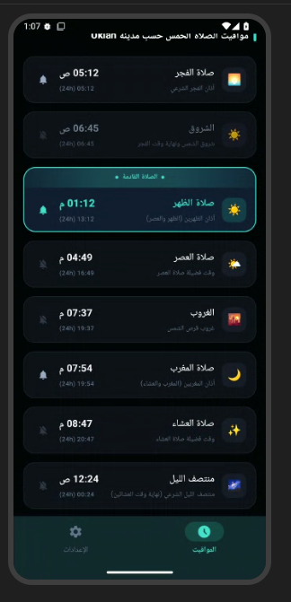
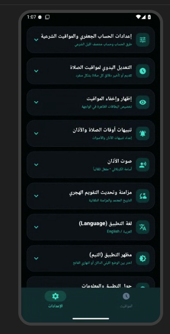

# مواقيت الصلاة الشيعية | Shia Prayer Times

## العربية 🇮🇶

تطبيق حديث ومخصص للمسلمين الشيعة، يوفّر **مواقيت الصلوات اليومية وفق الفقه الجعفري**، مع خيارات مرنة لضبط المواقيت والتنبيهات والإعدادات بما يتناسب مع احتياجات المستخدم.

### ✨ المميزات

- 🕌 مواقيت الصلوات الخمس: الفجر، الظهر، العصر، المغرب، والعشاء.
- 🌅 عرض وقت الشروق.
- 🌙 عرض منتصف الليل الشرعي.
- 📍 حساب المواقيت وفق الموقع الجغرافي.
- ⏰ إبراز الصلاة الحالية والقادمة.
- 🔔 تنبيهات لمواقيت الصلاة.
- 🔊 إعدادات صوت الأذان والتنبيهات.
- ⚙️ إمكانية التعديل اليدوي على أوقات الصلاة.
- 📅 عرض التاريخ والتقويم الهجري.
- 🔄 مزامنة وتحديث المواقيت.
- 🌐 دعم العربية والإنجليزية.
- 🎨 واجهة حديثة وبسيطة ومريحة للاستخدام.
- 🕋 إعدادات خاصة بالحساب الجعفري ومواقيت الصلاة.

### 📚 المصادر

يعتمد التطبيق على إرشادات ومصادر إسلامية شيعية موثوقة، ومن بينها:

**مكتب سماحة السيد علي السيستاني**  
الإرشادات والضوابط الفقهية المتعلقة بمواقيت الصلاة.

**شبكة الكفيل**  
خدمات وبيانات إسلامية مرتبطة بالمواقيت.

**حقيبة المؤمن**  
خدمات وبيانات إسلامية مساندة لوظائف المواقيت.

### 📱 لقطات الشاشة

#### مواقيت الصلاة

#### الإعدادات

### 🎯 الهدف

يهدف التطبيق إلى توفير وسيلة سهلة وواضحة للمستخدم الشيعي لمعرفة مواقيت الصلاة اليومية ومتابعتها، مع أدوات للتخصيص والتنبيه والمزامنة.

### 📌 تنبيه

قد تختلف مواقيت الصلاة باختلاف الموقع الجغرافي وإعدادات الحساب، لذلك يُنصح بالتحقق من المواقيت وفق موقع المستخدم والضوابط الشرعية المعتمدة.

### 👨‍💻 المطوّر

**م. محمد شهيد الأعاجيبي**

---

## English 🇬🇧

A modern Islamic prayer-times application designed for **Shia Muslims according to Ja'fari jurisprudence**, providing daily prayer times with flexible settings for calculation, notifications, manual adjustments, and synchronization.

### ✨ Features

- 🕌 Five daily prayer times: Fajr, Dhuhr, Asr, Maghrib, and Isha.
- 🌅 Sunrise time.
- 🌙 Islamic midnight (Nisf al-Layl).
- 📍 Prayer times based on geographic location.
- ⏰ Current and upcoming prayer highlighting.
- 🔔 Prayer-time notifications.
- 🔊 Adhan and notification sound settings.
- ⚙️ Manual prayer-time adjustments.
- 📅 Hijri date and calendar information.
- 🔄 Prayer-time synchronization and updates.
- 🌐 Arabic and English language support.
- 🎨 Modern, simple, and user-friendly interface.
- 🕋 Ja'fari calculation and prayer-time settings.

### 📚 Sources

The application uses trusted Shia Islamic guidance and services, including:

**Office of Sayyid Ali al-Sistani**  
Religious guidance and jurisprudential guidelines related to prayer times.

**Al-Kafeel Network**  
Islamic services and prayer-time data.

**Haqibat Al-Mu'min**  
Islamic services and supporting prayer-time data.

### 📱 Screenshots

#### Prayer Times

#### Settings

### 🎯 Purpose

The application aims to provide Shia Muslims with a simple and clear way to view and follow daily prayer times, together with customizable settings, notifications, and synchronization tools.

### 📌 Disclaimer

Prayer times may vary depending on geographic location and calculation settings. Users are advised to verify prayer times according to their location and applicable religious guidance.

### 👨‍💻 Developer

**Mohammed Shaheed Al-Ajaji**
